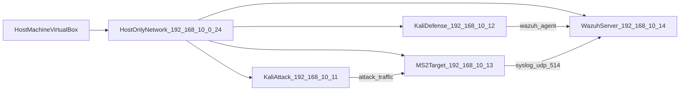

# SOC Lab Architecture

## Roles

- `Kali Attack VM`: executes attack scenarios for detection validation.
- `Kali Defense VM`: monitored endpoint with Wazuh agent.
- `MS-2 Target VM`: vulnerable target with syslog forwarding.
- `Wazuh Server VM`: SIEM manager/indexer/dashboard.

## Data Flow

1. Attacks originate from `192.168.10.11`.
2. Target and endpoint logs move to `192.168.10.14`.
3. Wazuh applies default + local custom rules.
4. Analyst validates detections and triages alerts in dashboard/API.
